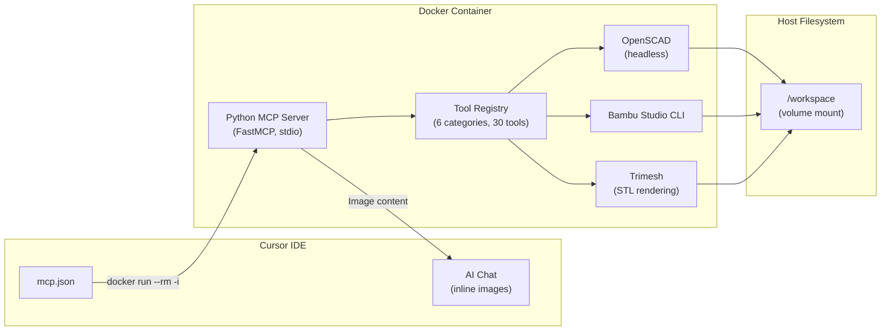

# mcp-3d-tools

[License: MIT](LICENSE)
[Python 3.12](https://python.org)
[Docker](Dockerfile)
[MCP](https://modelcontextprotocol.io)

**Bridge the gap between thought and 3D print.**

`mcp-3d-tools` is a [Model Context Protocol](https://modelcontextprotocol.io) server that gives AI coding assistants direct access to 3D modeling tools. Describe what you want to build, and the AI can render OpenSCAD files, see inline previews directly in chat, analyze mesh quality, sweep parametric designs, estimate print costs, and export print-ready 3MF files -- all without leaving your editor.

---

## Vision

Every 3D-printed project starts as an idea and ends at a build plate. The steps in between -- parametric modeling, STL export, dimensional verification, slicer configuration -- are manual context switches that break creative flow.

`mcp-3d-tools` eliminates those switches. It runs inside a Docker container, speaks the MCP protocol over stdio, and gives your AI assistant the same CLI tools a human would use. The AI can iterate on a design, verify dimensions, adjust tolerances, and prepare a print -- all in a single conversation.

The key innovation: **inline visual previews**. When the AI renders a model, the image appears directly in the chat. No more switching to a file browser to inspect output. The AI sees what it builds. You see what it builds. Together.

See [docs/ROADMAP.md](docs/ROADMAP.md) for the full plan.

---

## Architecture




- **Transport:** stdio over `docker run --rm -i` -- the IDE spawns the container and communicates via stdin/stdout.
- **Isolation:** All tools (OpenSCAD, Bambu Studio CLI, trimesh) run inside the Linux container. No host-side dependencies beyond Docker.
- **File access:** Your project directory is volume-mounted at `/workspace`. Tools read .scad source and write .stl/.3mf/.png output there.
- **Inline images:** Tools return PNG images as base64 content blocks via the MCP protocol. Cursor renders them directly in chat.

---

## Quickstart

### 1. Clone

```bash
git clone https://github.com/devaclark/mcp-3d-tools.git
cd mcp-3d-tools
```

### 2. Configure

```bash
cp .env.template .env
# Edit .env to set your printer/filament presets
```

### 3. Build

```bash
docker compose build
```

### 4. Add to Cursor IDE

Add the following to your `~/.cursor/mcp.json` (or `%USERPROFILE%\.cursor\mcp.json` on Windows):

```json
{
  "mcpServers": {
    "cad-tools": {
      "command": "docker",
      "args": [
        "run", "--rm", "-i",
        "-v", "/path/to/your/project:/workspace",
        "--env-file", "/path/to/mcp-3d-tools/.env",
        "smithie-cad-mcp:latest"
      ]
    }
  }
}
```

Replace `/path/to/your/project` with the directory containing your .scad files.

### 5. Restart Cursor

Restart Cursor IDE completely. The `cad-tools` MCP server will appear in your tool list with 30 tools across 6 categories.

---

## Tool Reference

### OpenSCAD Tools (8)


| Tool                   | Description                                           | Key Parameters                                |
| ---------------------- | ----------------------------------------------------- | --------------------------------------------- |
| `openscad_render`      | Render .scad to STL with inline preview               | `scad_file`, `variables`, `preview`           |
| `openscad_preview`     | Render .scad to PNG displayed inline in chat          | `scad_file`, `variables`, `imgsize`, `camera` |
| `openscad_export_3mf`  | Render .scad to 3MF geometry                          | `scad_file`, `variables`                      |
| `openscad_measure`     | Measure STL bounding box, volume, triangles           | `stl_file`                                    |
| `openscad_lint`        | Syntax-check .scad without rendering                  | `scad_file`                                   |
| `openscad_list_params` | Extract parametric variables from source              | `scad_file`                                   |
| `openscad_sweep`       | Sweep a variable across values with visual comparison | `scad_file`, `variable`, `values`             |
| `openscad_diff`        | Compare two STLs dimensionally                        | `stl_file_a`, `stl_file_b`                    |


### Visual Tools (4)


| Tool                    | Description                          | Key Parameters             |
| ----------------------- | ------------------------------------ | -------------------------- |
| `stl_preview`           | Render any STL to PNG inline in chat | `stl_file`, `camera_angle` |
| `turntable_preview`     | Multi-angle turntable views          | `stl_file`, `angles`       |
| `compare_models`        | Side-by-side visual comparison       | `stl_file_a`, `stl_file_b` |
| `cross_section_preview` | 2D cross-section at a Z-height       | `stl_file`, `z_height`     |


### Mesh Tools (4)


| Tool            | Description                                    | Key Parameters                          |
| --------------- | ---------------------------------------------- | --------------------------------------- |
| `mesh_analyze`  | Deep analysis: manifold, overhangs, thin walls | `stl_file`                              |
| `mesh_repair`   | Auto-fix non-manifold, holes, degenerates      | `stl_file`                              |
| `mesh_simplify` | Reduce triangle count preserving shape         | `stl_file`, `target_ratio`              |
| `mesh_boolean`  | Union/difference/intersection of two meshes    | `stl_file_a`, `stl_file_b`, `operation` |


### Bambu Studio Tools (6)


| Tool                      | Description                             | Key Parameters                      |
| ------------------------- | --------------------------------------- | ----------------------------------- |
| `bambu_slice`             | Slice STL(s) to print-ready 3MF         | `stl_files`, `arrange`, `orient`    |
| `bambu_arrange`           | Auto-arrange parts on build plate       | `stl_files`                         |
| `bambu_validate`          | Dry-run printability check              | `stl_files`                         |
| `bambu_estimate`          | Print time, filament, and cost estimate | `stl_files`, `filament_cost_per_kg` |
| `bambu_compare_materials` | Compare filament presets                | `stl_files`, `filament_presets`     |
| `bambu_profile_list`      | List available presets                  | --                                  |


### Workspace Tools (5)


| Tool               | Description                      | Key Parameters          |
| ------------------ | -------------------------------- | ----------------------- |
| `workspace_list`   | List all CAD files with metadata | `pattern`, `extensions` |
| `workspace_tree`   | Visual directory tree            | `root`, `max_depth`     |
| `workspace_read`   | Read file contents               | `file_path`             |
| `workspace_search` | Search by name or content        | `query`                 |
| `workspace_recent` | Recently modified files          | `count`                 |


### System Tools (3)


| Tool               | Description                           | Key Parameters |
| ------------------ | ------------------------------------- | -------------- |
| `cad_health`       | System status and tool availability   | --             |
| `cad_capabilities` | Full catalog of all tools             | --             |
| `cad_workflow`     | Suggest optimal tool chain for a goal | `goal`         |


### Example: Full Workflow

```
User: "Render camera_arm.scad with fit_profile=tight, measure the output,
       then slice it for my X1C."

AI calls:
  1. openscad_render(scad_file="camera_arm.scad", variables={"fit_profile": "tight"})
     → STL file created + inline preview image appears in chat
  2. openscad_measure(stl_file="camera_arm.stl")
     → Bounding box, volume, triangle count
  3. mesh_analyze(stl_file="camera_arm.stl")
     → Manifold check, overhangs, thin walls
  4. bambu_slice(stl_files=["camera_arm.stl"])
     → Print-ready 3MF with time and filament estimates
```

---

## Fit Profiles

This project was born from a real hardware build: a PETG-HF camera arm for a Jetson Orin Nano cyberdeck. The OpenSCAD source supports three fit profiles that account for PETG shrinkage and print tolerances:


| Profile  | PETG Tolerance | Wire Tunnel Clearance | Ribbon Chamber | Use Case                              |
| -------- | -------------- | --------------------- | -------------- | ------------------------------------- |
| `tight`  | +0.35 mm       | +0.25 mm              | 32.35 mm       | Precision parts, low shrink filaments |
| `normal` | +0.60 mm       | +0.35 mm              | 32.60 mm       | Standard PETG-HF prints               |
| `loose`  | +0.85 mm       | +0.45 mm              | 32.85 mm       | High-shrink filaments, large parts    |


Pass the profile as a variable override:

```
openscad_render(scad_file="camera_arm.scad", variables={"fit_profile": "normal"})
```

---

## Configuration

All configuration is in `.env` (copied from `.env.template`):


| Variable                | Default                                       | Description                                        |
| ----------------------- | --------------------------------------------- | -------------------------------------------------- |
| `WORKSPACE_ROOT`        | `/workspace`                                  | Container path to mounted project directory        |
| `LOG_LEVEL`             | `INFO`                                        | Python logging level (DEBUG, INFO, WARNING, ERROR) |
| `MCP_TOOL_CATEGORIES`   | `openscad,bambu,visual,mesh,workspace,system` | Enabled tool categories                            |
| `OPENSCAD_BIN`          | `/usr/bin/openscad`                           | Path to OpenSCAD binary inside container           |
| `BAMBU_BIN`             | `/usr/local/bin/bambu-studio`                 | Path to Bambu Studio CLI inside container          |
| `BAMBU_PRINTER_PRESET`  | `Bambu Lab X1 Carbon 0.4 nozzle`              | Default printer preset for slicing                 |
| `BAMBU_FILAMENT_PRESET` | `Bambu PETG-HF`                               | Default filament preset for slicing                |


---

## Supported Platforms


| Platform      | Status    | Notes                   |
| ------------- | --------- | ----------------------- |
| Windows 10/11 | Primary   | Docker Desktop required |
| Linux         | Supported | Docker or Podman        |
| macOS         | Supported | Docker Desktop required |


---

## Adding New Tools

The tool registry uses a plugin pattern. To add a new tool category:

1. Create `tools/your_tools.py` with tool functions and a `register()` entry point
2. Add the category name to `CATEGORY_MODULES` in `tools/registry.py`
3. Add the category to `MCP_TOOL_CATEGORIES` in `.env`
4. Rebuild the Docker image

See [docs/CONTRIBUTING.md](docs/CONTRIBUTING.md) for a step-by-step guide.

---

## Roadmap


| Phase          | Timeline     | Focus                                                                                                   |
| -------------- | ------------ | ------------------------------------------------------------------------------------------------------- |
| **1-3 (Done)** | Apr 2026     | 30 tools: render, preview, measure, slice, analyze, repair, sweep, compare, estimate, workspace, system |
| **4**          | May-Jun 2026 | Analysis heatmaps, multi-material AMS, animated turntable                                               |
| **5**          | Jun-Jul 2026 | KiCad PCB bridge, FreeCAD/STEP import, BOM generator                                                    |
| **6**          | Jul-Aug 2026 | Persistent knowledge store, design intent memory, printer fleet                                         |
| **7**          | Aug-Oct 2026 | Vision-based print QA, generative design, community plugins                                             |


See [docs/ROADMAP.md](docs/ROADMAP.md) for detailed feature descriptions.

---

## License

[MIT](LICENSE)