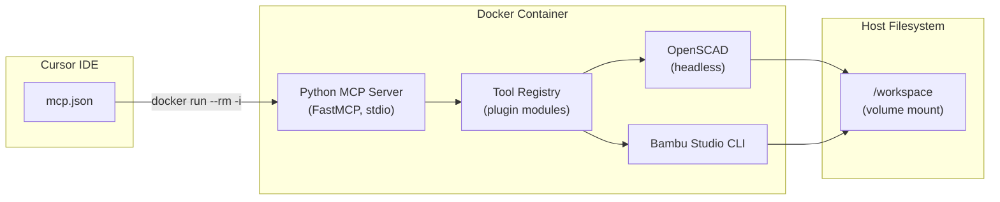

# mcp-3d-tools

[](LICENSE)
[](https://python.org)
[](Dockerfile)
[](https://modelcontextprotocol.io)

**Bridge the gap between thought and 3D print.**

`mcp-3d-tools` is a [Model Context Protocol](https://modelcontextprotocol.io) server that gives AI coding assistants direct access to 3D modeling tools. Describe what you want to build, and the AI can render OpenSCAD files, measure parts, slice for your Bambu Lab printer, and export print-ready 3MF files — all without leaving your editor.

---

## Vision

Every 3D-printed project starts as an idea and ends at a build plate. The steps in between — parametric modeling, STL export, dimensional verification, slicer configuration — are manual context switches that break creative flow.

`mcp-3d-tools` eliminates those switches. It runs inside a Docker container, speaks the MCP protocol over stdio, and gives your AI assistant the same CLI tools a human would use. The AI can iterate on a design, verify dimensions, adjust tolerances, and prepare a print — all in a single conversation.

This is Phase 1. The roadmap goes much further: mesh repair, multi-material slicing, PCB enclosure generation, print quality monitoring, and eventually generative design. See [docs/ROADMAP.md](docs/ROADMAP.md) for the full plan.

---

## Architecture



- **Transport:** stdio over `docker run --rm -i` — the IDE spawns the container and communicates via stdin/stdout.
- **Isolation:** All tools (OpenSCAD, Bambu Studio CLI) run inside the Linux container. No host-side dependencies beyond Docker.
- **File access:** Your project directory is volume-mounted at `/workspace`. Tools read .scad source and write .stl/.3mf/.png output there.
- **Secrets:** Environment variables are loaded from a `.env` file via Docker's `--env-file` flag. Nothing is baked into the image.

---

## Quickstart

### 1. Clone

```bash
git clone https://github.com/devaclark/mcp-3d-tools.git
cd mcp-3d-tools
```

### 2. Configure

```bash
cp .env.template .env
# Edit .env to set your printer/filament presets
```

### 3. Build

```bash
docker compose build
```

### 4. Add to Cursor IDE

Add the following to your `~/.cursor/mcp.json` (or `%USERPROFILE%\.cursor\mcp.json` on Windows):

```json
{
  "mcpServers": {
    "cad-tools": {
      "command": "docker",
      "args": [
        "run", "--rm", "-i",
        "-v", "/path/to/your/project:/workspace",
        "--env-file", "/path/to/mcp-3d-tools/.env",
        "smithie-cad-mcp:latest"
      ]
    }
  }
}
```

Replace `/path/to/your/project` with the directory containing your .scad files.

### 5. Restart Cursor

Restart Cursor IDE completely. The `cad-tools` MCP server will appear in your tool list.

---

## Tool Reference

### OpenSCAD Tools

| Tool | Description | Key Parameters |
|------|-------------|----------------|
| `openscad_render` | Render .scad to .stl | `scad_file`, `output_file`, `variables`, `timeout` |
| `openscad_preview` | Render .scad to .png preview | `scad_file`, `output_file`, `variables`, `imgsize`, `camera` |
| `openscad_export_3mf` | Render .scad to .3mf geometry | `scad_file`, `output_file`, `variables` |
| `openscad_measure` | Measure STL bounding box, volume, triangle count | `stl_file` |

### Bambu Studio Tools

| Tool | Description | Key Parameters |
|------|-------------|----------------|
| `bambu_slice` | Slice STL(s) and export print-ready .3mf | `stl_files`, `output_file`, `arrange`, `orient` |
| `bambu_arrange` | Auto-arrange parts on build plate | `stl_files`, `output_file` |
| `bambu_validate` | Dry-run slice to check printability | `stl_files` |

### Example: Full Workflow

```
User: "Render camera_arm.scad with fit_profile=tight, measure the output,
       then slice it for my X1C."

AI calls:
  1. openscad_render(scad_file="camera_arm.scad", variables={"fit_profile": "tight"})
  2. openscad_measure(stl_file="camera_arm.stl")
  3. bambu_slice(stl_files=["camera_arm.stl"])
```

---

## Fit Profiles

This project was born from a real hardware build: a PETG-HF camera arm for a Jetson Orin Nano cyberdeck. The OpenSCAD source supports three fit profiles that account for PETG shrinkage and print tolerances:

| Profile | PETG Tolerance | Wire Tunnel Clearance | Ribbon Chamber | Use Case |
|---------|---------------|-----------------------|----------------|----------|
| `tight` | +0.35 mm | +0.25 mm | 32.35 mm | Precision parts, low shrink filaments |
| `normal` | +0.60 mm | +0.35 mm | 32.60 mm | Standard PETG-HF prints |
| `loose` | +0.85 mm | +0.45 mm | 32.85 mm | High-shrink filaments, large parts |

Pass the profile as a variable override:

```
openscad_render(scad_file="camera_arm.scad", variables={"fit_profile": "normal"})
```

---

## Configuration

All configuration is in `.env` (copied from `.env.template`):

| Variable | Default | Description |
|----------|---------|-------------|
| `WORKSPACE_ROOT` | `/workspace` | Container path to mounted project directory |
| `LOG_LEVEL` | `INFO` | Python logging level (DEBUG, INFO, WARNING, ERROR) |
| `MCP_TOOL_CATEGORIES` | `openscad,bambu` | Comma-separated list of enabled tool categories |
| `OPENSCAD_BIN` | `/usr/bin/openscad` | Path to OpenSCAD binary inside container |
| `BAMBU_BIN` | `/usr/local/bin/bambu-studio` | Path to Bambu Studio CLI inside container |
| `BAMBU_PRINTER_PRESET` | `Bambu Lab X1 Carbon 0.4 nozzle` | Default printer preset for slicing |
| `BAMBU_FILAMENT_PRESET` | `Bambu PETG-HF` | Default filament preset for slicing |

---

## Supported Platforms

| Platform | Status | Notes |
|----------|--------|-------|
| Windows 10/11 | Primary | Docker Desktop required |
| Linux | Supported | Docker or Podman |
| macOS | Supported | Docker Desktop required |

---

## Adding New Tools

The tool registry uses a plugin pattern. To add a new tool category:

1. Create `tools/your_tools.py` with tool functions and a `register()` entry point
2. Add the category name to `CATEGORY_MODULES` in `tools/registry.py`
3. Add the category to `MCP_TOOL_CATEGORIES` in `.env`
4. Rebuild the Docker image

See [docs/CONTRIBUTING.md](docs/CONTRIBUTING.md) for a step-by-step guide.

---

## Roadmap

| Phase | Timeline | Focus |
|-------|----------|-------|
| **1 (Now)** | Apr 2026 | OpenSCAD render/preview/measure, Bambu CLI slice/arrange/validate |
| **2** | May–Jun 2026 | STL mesh analysis and repair, multi-material presets, parametric explorer |
| **3** | Jun–Jul 2026 | KiCad PCB enclosure bridge, FreeCAD/STEP import, print cost estimator |
| **4** | Jul–Aug 2026 | Persistent knowledge store, design intent memory, printer fleet management |
| **5** | Aug–Oct 2026 | Vision-based print QA, generative design suggestions, community plugins |

See [docs/ROADMAP.md](docs/ROADMAP.md) for detailed feature descriptions.

---

## License

[MIT](LICENSE)
