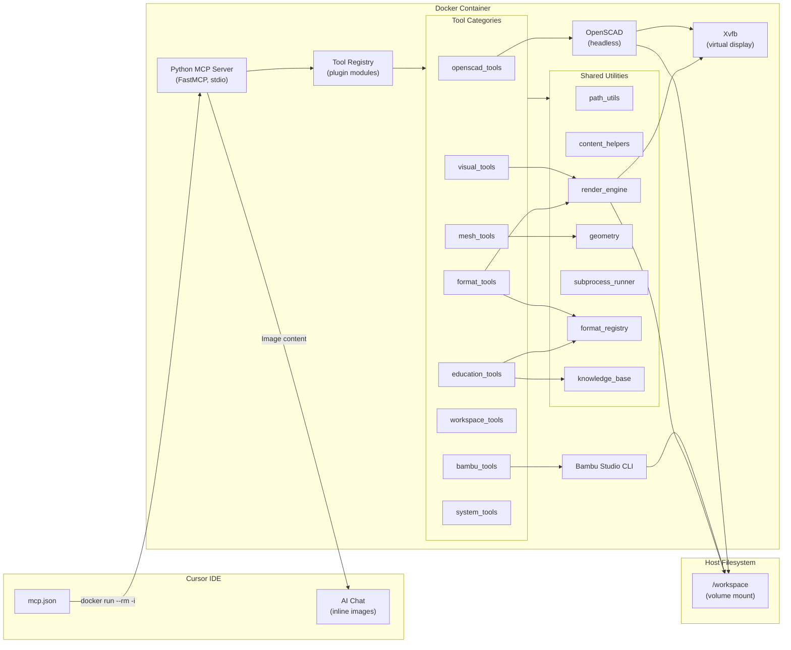

# Architecture

This document describes the internal architecture of `mcp-3d-tools`.

## High-Level Overview



## Transport: stdio over Docker

The MCP server communicates with the IDE using **stdio transport**. Cursor IDE spawns a Docker container as a subprocess:

```
docker run --rm -i smithie-cad-mcp:latest
```

- `**--rm**`: Container is destroyed when the IDE disconnects (no stale state).
- `**-i**`: Interactive mode keeps stdin open for bidirectional JSON-RPC communication.
- JSON-RPC messages flow over stdout (server -> IDE) and stdin (IDE -> server).
- Logging goes to stderr so it never contaminates the protocol stream.

### Why Docker instead of a native process?

1. **Isolation** -- OpenSCAD and Bambu Studio CLI run inside the container with all their dependencies. The host only needs Docker.
2. **Portability** -- Same image works on Windows, Linux, and macOS.
3. **Reproducibility** -- Pinned versions of OpenSCAD and Bambu Studio. No "works on my machine" issues.
4. **Security** -- The container only sees files in the mounted workspace volume.

## Plugin Registry

Tools are organized into **categories**, each backed by a Python module:

```
tools/
  registry.py            # Discovers and loads category modules
  openscad_tools.py      # Category: openscad (8 tools)
  bambu_tools.py         # Category: bambu (6 tools)
  visual_tools.py        # Category: visual (4 tools)
  mesh_tools.py          # Category: mesh (4 tools)
  format_tools.py        # Category: format (4 tools) — universal 3D format support
  workspace_tools.py     # Category: workspace (5 tools)
  education_tools.py     # Category: education (3 tools) — teaching and best practices
  system_tools.py        # Category: system (4 tools)
```

### Loading flow

1. `server.py` calls `load_tools(mcp.tool)` at startup.
2. `registry.py` reads `MCP_TOOL_CATEGORIES` from the environment.
3. For each enabled category, it imports the corresponding module via `CATEGORY_MODULES` mapping.
4. Each module's `register(tool_decorator)` function is called, which registers individual tool functions with FastMCP.

### Adding a new category

1. Create `tools/new_category_tools.py` with async tool functions.
2. Add a `register(tool_decorator)` function that calls `tool_decorator(fn)` for each tool.
3. Add `"new_category": "tools.new_category_tools"` to `CATEGORY_MODULES` in `registry.py`.
4. Add `new_category` to `MCP_TOOL_CATEGORIES` in `.env`.

No changes to `server.py` are needed.

## Shared Utilities

Common functionality is extracted into `utils/`:

```
utils/
  path_utils.py          # Path resolution, workspace glob, tree builder
  content_helpers.py     # JSON + Image response builders for inline chat display
  render_engine.py       # Universal 3D-to-PNG rendering (STL, OBJ, STEP, PLY, etc.)
  geometry.py            # STL measurement (bounding box, volume, triangles)
  subprocess_runner.py   # Async subprocess execution with timeout and structured output
  format_registry.py     # 3D format intelligence: metadata, loaders, conversion matrix
  knowledge_base.py      # Educational content: concepts, best practices, format guides
```

### Path Resolution (`path_utils.py`)

All tool modules share a single `resolve()` function that converts workspace-relative paths to absolute container paths. Additional helpers include `ensure_parent()`, `with_suffix()`, `workspace_glob()`, and `build_tree()`.

### Content Helpers (`content_helpers.py`)

Standardized response builders that return both JSON metadata and inline images:

```python
from utils.content_helpers import success_with_image

return success_with_image(
    {"success": True, "output_file": dst, ...},
    image_path=dst,
)
```

This returns a list containing a JSON text block and a FastMCP `Image` object. Cursor renders the image directly in the chat.

### Render Engine (`render_engine.py`)

A dual-backend rendering pipeline for STL-to-PNG conversion:

1. **Primary: pyrender** -- Hardware-accelerated OpenGL rendering via the Xvfb virtual framebuffer. Produces high-quality images with lighting, materials, and shadows.
2. **Fallback: matplotlib** -- Software 3D projection using `mpl_toolkits.mplot3d`. Works without GPU support.

Supports camera presets (isometric, front, top, etc.), custom azimuth/elevation angles, multi-angle turntable renders, and 2D cross-section profiles.

## Volume Mount Bridge

The host filesystem is mounted into the container:

```
-v C:\smithie.co\research\cyber-deck:/workspace
```

- All tool functions resolve paths via `utils.path_utils.resolve()`.
- Tools can read .scad source files and write .stl/.3mf/.png output.
- The `resolve()` function handles both absolute and workspace-relative paths.

## Inline Image Rendering

Tools that produce visual output return FastMCP `Image` objects alongside JSON metadata. The MCP protocol encodes these as base64 image content blocks, which Cursor renders inline in the chat.

```python
from fastmcp.utilities.types import Image

async def openscad_preview(...) -> list:
    # ... render to PNG ...
    return [
        json.dumps({"success": True, "output_file": dst}),
        Image(path=dst),
    ]
```

This architecture means the AI (and user) see design outputs immediately without leaving the conversation.

## Security Model

- **No secrets in the image**: All configuration is injected via `--env-file` at runtime.
- **No network access required**: Tools operate on local files only. The container can run with `--network=none` for extra isolation.
- **Read/write scope**: Limited to the mounted volume. The container cannot access files outside the workspace.
- **No persistent state**: `--rm` ensures the container is destroyed after each session.

## Headless Rendering

Both OpenSCAD and pyrender require a display server. The container runs Xvfb (X Virtual Framebuffer) in the background:

```bash
Xvfb :99 -screen 0 1024x768x24 &
export DISPLAY=:99
exec python server.py
```

Additionally, `PYOPENGL_PLATFORM=osmesa` is set for off-screen Mesa rendering as a fallback.

## Subprocess Execution

All external tool invocations go through `utils/subprocess_runner.py`:

- **Async execution** via `asyncio.create_subprocess_exec`
- **Configurable timeout** (default 120s, overridable per call)
- **Structured output** via `RunResult` dataclass (exit code, stdout, stderr, timing, timeout flag)
- **Safe cleanup** -- processes are killed on timeout
- **Logging** -- all commands are logged to stderr with timing data

## Tool Count Summary

| Category  | Tools | Description                                |
|-----------|-------|--------------------------------------------|
| openscad  | 8     | Render, preview, export, measure, lint, params, sweep, diff |
| bambu     | 6     | Slice, arrange, validate, estimate, compare, profiles |
| visual    | 4     | STL preview, turntable, compare, cross-section |
| mesh      | 4     | Analyze, repair, simplify, boolean         |
| format    | 4     | Detect, info, preview (universal), convert |
| workspace | 5     | List, tree, read, search, recent           |
| education | 3     | Explain concepts, format guides, best practices |
| system    | 4     | Health, capabilities, workflow, recommend tools |
| **Total** | **38**|                                            |
