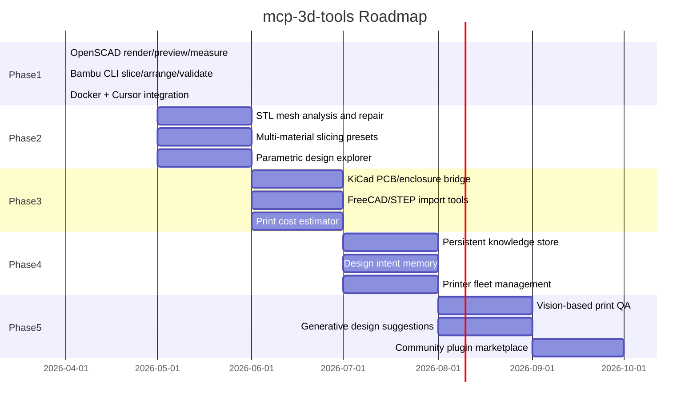

# Roadmap

The long-term vision for `mcp-3d-tools`: an AI-native bridge from design intent to physical object.

---

## Phase 1: Core Pipeline (April 2026) — DONE

The foundation: render, measure, slice, export.

- **OpenSCAD integration** — Headless rendering to STL/3MF/PNG with variable overrides. Bounding-box and volume measurement via numpy-stl.
- **Bambu Studio CLI** — Slice STLs with printer/filament/process presets. Auto-arrange and auto-orient. Dry-run validation.
- **Docker packaging** — Self-contained Linux container with stdio MCP transport. Volume-mounted workspace. Env-file secrets bridge.
- **Plugin registry** — Category-based tool loading so new tools can be added without touching the server core.

---

## Phase 2: Mesh Intelligence (May–June 2026)

Make the AI understand geometry, not just file paths.

- **STL mesh analysis** — Surface area, wall thickness detection, overhang angle analysis, manifold validation.
- **Automatic mesh repair** — Fix non-manifold edges, fill holes, remove degenerate triangles. Use libraries like trimesh or MeshFix.
- **Multi-material slicing** — Support for multi-filament prints. AMS slot assignment. Paint-on color zone definitions.
- **Parametric design explorer** — Sweep a variable range (e.g., wall thickness 1.0–3.0 in 0.25 steps), render each variant, compare dimensions. Help find the optimal parameter value.

---

## Phase 3: Cross-Domain Bridges (June–July 2026)

Connect 3D printing to adjacent engineering domains.

- **KiCad PCB enclosure generation** — Read a KiCad PCB file, extract board outline and connector positions, generate a parametric OpenSCAD enclosure that fits the board.
- **FreeCAD / STEP import** — Import STEP/IGES files via FreeCAD's headless Python API. Convert to STL for slicing. Extract feature dimensions.
- **Print cost estimator** — Calculate filament usage (weight and length), estimated print time, and material cost from slicer output. Compare across filament types.

---

## Phase 4: Memory and Learning (July–August 2026)

Give the system persistent knowledge across sessions.

- **Persistent knowledge store** — A Docker volume with a SQLite or DuckDB database. Store design decisions, measurement history, successful print configurations.
- **Design intent memory** — The AI remembers what you're building, what tolerances worked, which profiles you preferred. It can suggest settings for new parts based on past successes.
- **Printer fleet management** — Track multiple printers (model, nozzle size, bed size, installed filaments). Auto-select the best printer for a given job. Monitor print queue.

---

## Phase 5: Autonomous Quality (August–October 2026)

Close the loop between digital design and physical output.

- **Vision-based print QA** — Connect to a camera pointed at the print bed. Compare in-progress prints against the expected geometry. Detect layer adhesion failures, warping, stringing.
- **Generative design suggestions** — Given constraints (max weight, minimum wall thickness, specific mounting points), suggest design modifications or generate OpenSCAD geometry.
- **Community plugin marketplace** — A registry where contributors publish tool modules (e.g., `resin-printer-tools`, `laser-cutter-tools`). Install via `mcp-3d-tools install <plugin>`.

---

## Contributing

Want to help build a phase? See [CONTRIBUTING.md](CONTRIBUTING.md) for how to add new tool modules. Open an issue to discuss a feature before starting work.
