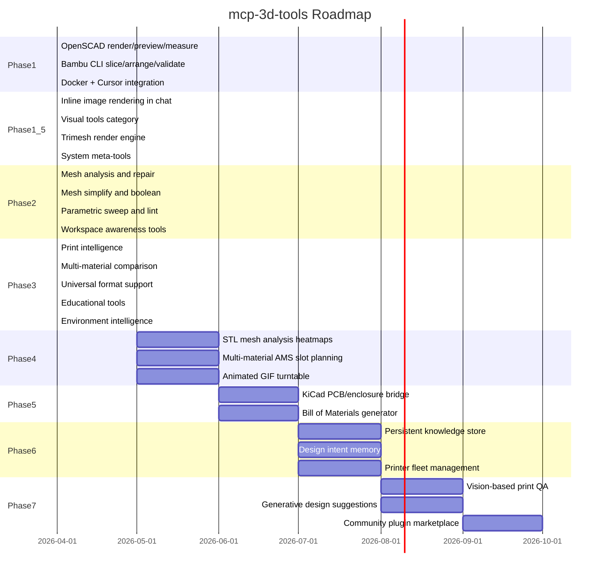

# Roadmap

The long-term vision for `mcp-3d-tools`: an AI-native bridge from design intent to physical object.

---

## Phase 1: Core Pipeline (April 2026) -- DONE

The foundation: render, measure, slice, export.

- **OpenSCAD integration** -- Headless rendering to STL/3MF/PNG with variable overrides. Bounding-box and volume measurement via numpy-stl.
- **Bambu Studio CLI** -- Slice STLs with printer/filament/process presets. Auto-arrange and auto-orient. Dry-run validation.
- **Docker packaging** -- Self-contained Linux container with stdio MCP transport. Volume-mounted workspace. Env-file secrets bridge.
- **Plugin registry** -- Category-based tool loading so new tools can be added without touching the server core.

---

## Phase 1.5: Visual Intelligence (April 2026) -- DONE

Making the AI sighted -- every tool that produces geometry returns a visual.

- **Inline image rendering** -- `openscad_preview` and `openscad_render` now return PNG images directly in chat via FastMCP's `Image` type. No more leaving the conversation to inspect output files.
- **STL preview** -- Render any STL to a PNG using trimesh, independent of OpenSCAD source. Works with imported models, repaired meshes, any STL.
- **Turntable views** -- Multi-angle renders around the Z-axis for spatial understanding without a 3D viewer.
- **Model comparison** -- Side-by-side visual and dimensional comparison of two STL files.
- **Cross-section preview** -- Slice a mesh at any Z-height and see the 2D profile inline.
- **Render engine** -- Dual-backend rendering: pyrender for high-quality GL renders, matplotlib fallback for environments without GPU.

---

## Phase 2: Mesh + Parametric Intelligence (April 2026) -- DONE

Deep geometry understanding and design-space exploration.

- **Mesh analysis** -- Manifold check, surface area, center of mass, overhang detection, thin wall detection, face quality statistics.
- **Mesh repair** -- Auto-fix non-manifold edges, fill holes, remove degenerate triangles, fix winding via trimesh.
- **Mesh simplify** -- Quadric decimation to reduce triangle count while preserving shape.
- **Mesh boolean** -- Union, difference, and intersection operations on STL pairs.
- **Parametric list** -- Parse OpenSCAD source to extract variable declarations, defaults, and Customizer annotations.
- **Parametric sweep** -- Sweep a variable across a range of values, render and measure each variant, return a visual comparison grid.
- **SCAD lint** -- Syntax-check OpenSCAD files without rendering (fast feedback).
- **STL diff** -- Compare two meshes dimensionally: per-axis deltas, volume changes.

---

## Phase 2.5: Workspace + Print Intelligence (April 2026) -- DONE

Project awareness and complete digital-to-physical bridge.

- **Workspace list** -- Discover all CAD files with metadata (size, type, modification date).
- **Workspace tree** -- Visual directory tree for project orientation.
- **Workspace read** -- Read file contents so the AI understands SCAD source and configs.
- **Workspace search** -- Search by filename glob or content substring.
- **Workspace recent** -- Show recently modified files to resume work.
- **Print estimation** -- Extract print time, filament usage, and cost from slicer output.
- **Material comparison** -- Slice with multiple filament presets and compare time/cost/weight.
- **Profile listing** -- List available printer/filament/process presets.

---

## Phase 3: System Meta-Intelligence (April 2026) -- DONE

Self-awareness and guided workflows.

- **Health check** -- Report system status: tool versions, disk space, Python dependencies.
- **Capabilities catalog** -- Full self-documentation of all tools, organized by category.
- **Workflow guidance** -- Match user goals to optimal tool chains with step-by-step recommendations.

---

## Phase 3.5: Universal Format Intelligence (April 2026) -- DONE

Format-agnostic 3D tools and educational capabilities.

- **Format registry** -- Comprehensive metadata for 20+ 3D file formats including capabilities, industry context, recommended programs, and conversion compatibility matrix.
- **Universal preview** -- `model_preview` auto-detects and renders any supported 3D format (STL, OBJ, PLY, 3MF, GLB, STEP, IGES, BREP, and more) inline in chat.
- **Format conversion** -- `model_convert` converts between formats with fidelity analysis (reports what's lost in conversion).
- **STEP/IGES support** -- OpenCascade via cadquery for loading and converting solid geometry formats.
- **Educational tools** -- `cad_explain` teaches 3D modeling and printing concepts. `format_guide` provides industry guidance for any format. `cad_best_practices` gives actionable checklists by material or technique.
- **Environment intelligence** -- Enhanced `cad_health` probes for all available programs. `cad_recommend_tools` suggests industry-standard software based on file types and workflow goals.
- **Consistent return types** -- All 38 tools now return `list` for reliable `outputSchema` compliance (fixes inline image rendering in Cursor).

---

## Phase 4: Advanced Visualization (May--June 2026)

Enhanced visual intelligence with analysis heatmaps.

- **Overhang heatmap** -- Color-coded visualization of overhang angles on the mesh surface.
- **Thin wall heatmap** -- Highlight areas with wall thickness below a threshold.
- **Multi-material AMS** -- AMS slot assignment and paint-on color zone definitions for multi-filament prints.
- **Animated GIF turntable** -- Combine turntable frames into a single animated preview.

---

## Phase 5: Cross-Domain Bridges (June--July 2026)

Connect 3D printing to adjacent engineering domains.

- **KiCad PCB enclosure** -- Read KiCad PCB files, extract board outline and connector positions, generate parametric OpenSCAD enclosures.
- **Bill of Materials** -- Generate a BOM from multi-part assemblies with filament estimates per part.

---

## Phase 6: Memory and Learning (July--August 2026)

Persistent knowledge across sessions.

- **Knowledge store** -- SQLite/DuckDB database in a Docker volume for design decisions, measurement history, successful configurations.
- **Design intent memory** -- Remember tolerances, profiles, and preferences. Suggest settings for new parts based on past successes.
- **Printer fleet management** -- Track multiple printers (model, nozzle, bed size, filaments). Auto-select the best printer for a job.

---

## Phase 7: Autonomous Quality (August--October 2026)

Close the loop between digital design and physical output.

- **Vision-based print QA** -- Camera integration for comparing in-progress prints against expected geometry. Detect warping, stringing, adhesion failures.
- **Generative design** -- Given constraints (weight, wall thickness, mounting points), suggest design modifications or generate geometry.
- **Community plugins** -- A registry where contributors publish tool modules. Install via `mcp-3d-tools install <plugin>`.

---

## Tool Count by Phase

| Phase | Status | Tools | Running Total |
|-------|--------|-------|---------------|
| 1 | Done | 7 | 7 |
| 1.5 | Done | 4 | 11 |
| 2 | Done | 12 | 23 |
| 2.5 | Done | 8 | 31 |
| 3 | Done | 3 | 34 |
| 4 | Planned | ~4 | ~38 |
| 5 | Planned | ~3 | ~41 |
| 6 | Planned | ~3 | ~44 |
| 7 | Planned | ~3 | ~47 |

---

## Contributing

Want to help build a phase? See [CONTRIBUTING.md](CONTRIBUTING.md) for how to add new tool modules. Open an issue to discuss a feature before starting work.
